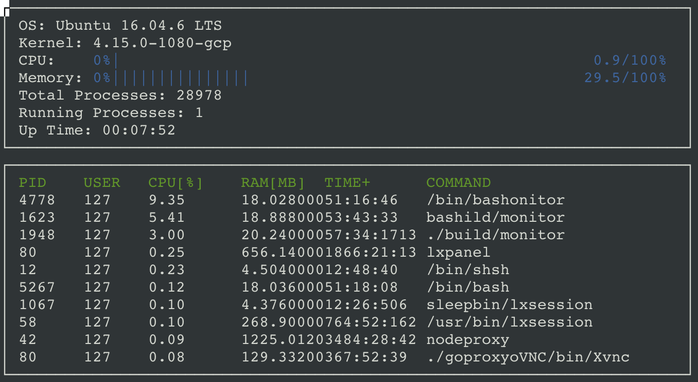

# CppND-System-Monitor

System Monitor Project in the Object Oriented Programming Course of the [Udacity C++ Nanodegree Program](https://www.udacity.com/course/c-plus-plus-nanodegree--nd213).

The source code and documentation here are copied and pasted from https://github.com/udacity/CppND-System-Monitor-Project-Updated

